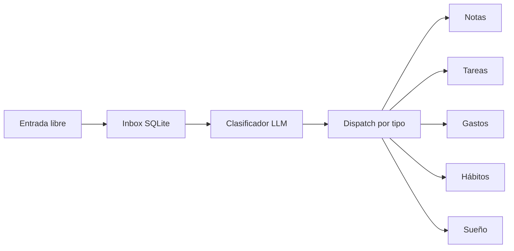

<div align="center">

# CoreOS

### Captura primero. Organiza después.

Un segundo cerebro personal local-first para capturas de texto en formato
libre, persistidas en el dispositivo y organizadas automáticamente por un
clasificador de IA.

[](#)
[](#)
[](#)
[](#)

[repository](https://github.com/EzequielMenor/CoreOS) · [ezequielmenor.es](https://ezequielmenor.es)

[English](README.md) · **Español**

</div>

---

## ¿Qué es CoreOS?

La mayoría de apps de notas y tareas te obligan a decidir *dónde* va algo
antes de poder guardarlo: elige un cuaderno, un proyecto, una lista, una
etiqueta. Ese coste de decisión es lo que impide que la mayoría de las
capturas lleguen a producirse.

CoreOS lo elimina:

> **Capturar → Persistir localmente → Clasificar con IA → Organizar automáticamente**

Escribes texto en formato libre. Se guarda en el dispositivo antes de
cualquier llamada a la IA. Un LLM lo clasifica en una tabla estructurada.
La entrada cruda nunca se pierde, nunca se reescribe, y la organización
ocurre *después* de la captura, nunca antes.

## Capturas de pantalla

| Hoy | Capturar | Biblioteca |
| --- | --- | --- |
|  |  |  |
| Tareas del día y capturas pendientes de un vistazo. | Un único campo. Lo que quieras recordar. | Notas agrupadas por antigüedad, con búsqueda full-text. |

## Cómo funciona



Propiedades clave:

- **La entrada cruda se persiste primero** — el INSERT en SQLite ocurre
  antes de la llamada de red.
- **`raw_text` es canónico** — para notas se almacena de forma literal como
  `body_md`. El LLM solo emite metadata (título y tags sugeridos); nunca
  reescribe, resume ni fragmenta el texto del usuario.
- **Un fallo de la IA nunca descarta capturas** — una respuesta inválida o
  fallida del modelo deja la fila del inbox en estado `pending`,
  reintentable desde Hoy.

## 🔒 Local-first por diseño

- Base de datos SQLite en el dispositivo
- Sin backend, sin servicio remoto
- Sin cuenta, sin autenticación
- Claves de API guardadas en `expo-secure-store` (iOS Keychain / Android EncryptedSharedPreferences)
- Captura persistida antes de cualquier llamada a la IA
- Un fallo de la IA deja la captura en `pending` — el texto crudo nunca se pierde

## V1 actual

Tres pestañas (Hoy, Capturar, Biblioteca) más Tareas y Ajustes como
pantallas secundarias.

**Hoy** — tareas pendientes y vencidas, ordenadas primero por vencimiento y
luego por prioridad. Completado inline. Un chip muestra las capturas sin
clasificar y, al pulsarlo, relanza el pipeline.

**Capturar** — un único campo de texto libre. Al guardar, el texto se inserta
en el inbox local y el clasificador asíncrono se ejecuta. También accesible
desde el menú de compartir de iOS y desde el deeplink `coreos://capture`.

**Biblioteca** — notas agrupadas en Fijadas / Hoy / Ayer / Esta semana /
Anteriores. Búsqueda full-text, filtros por tags, editor Markdown con
autosave, fijar, soft-delete con deshacer y restaurar.

**Tareas** — CRUD completo con normalización de fechas para entradas
libres en `due_date` (`hoy`, `mañana`, `d/m/y`, ISO → `YYYY-MM-DD`).

<details>
<summary><strong>Detalles de arquitectura</strong></summary>

### Invariantes del pipeline

Documentados en `src/services/inbox.ts` y forzados en código:

- La fila del inbox se marca como `processed` dentro de la misma transacción
  que el dispatch, protegida por `WHERE status='pending'` (lock optimista).
- Los ítems se procesan **de forma secuencial** (`for/await`, nunca
  `Promise.all`).
- Las funciones del pipeline exportadas **nunca lanzan** — devuelven un
  resultado que el caller puede reintentar.
- Un mutex a nivel de módulo (`_batchInFlight`) evita batches concurrentes;
  capturas tardías disparan automáticamente una pasada extra de drenaje.

### Layout de fuentes

```
src/app/         pantallas expo-router (file-based, typed routes)
src/stores/      stores Zustand
src/db/          singleton SQLite, migraciones, dispatcher
src/db/queries/  módulos de query por dominio
src/services/    cliente LLM + orquestación del inbox
src/components/  UI compartida
src/hooks/       tema, editor de notas
src/lib/         animaciones + note save gate
src/constants/   tokens de tema
```

### Esquema de notas y búsqueda

- Las notas tienen una tabla virtual FTS5 (`notes_fts`) con
  `tokenize='porter unicode61'`, rankeada con `bm25`.
- Triggers mantienen el índice FTS sincronizado en INSERT / UPDATE / DELETE.
- Soft-delete vía `deleted_at`; restaurar lo pone a `NULL`.

### Tipos de clasificación

El LLM emite uno de cinco tipos: `nota`, `gasto`, `tarea`, `habito`, `sueno`.
El esquema de cada uno se valida en cliente en `processInboxText`; si la
respuesta carece de campos obligatorios o devuelve un tipo desconocido, el
pipeline registra un warning y deja la fila en `pending` para que el
siguiente batch la vuelva a tomar. El `raw_text` nunca se pierde — la fila
solo pasa a `processed` cuando un dispatch válido tiene éxito dentro de la
misma transacción.

### Tabs nativos

Los `unstable-native-tabs` de `expo-router` renderizan la tab bar nativa de
iOS en iOS; Android y web caen a una implementación en JS. Por eso se
necesita una development build (Expo Go no basta).

</details>

## Stack técnico

| Capa | Elección |
|---|---|
| Framework | Expo SDK 57, React Native 0.86 |
| Lenguaje | TypeScript, strict |
| Routing | `expo-router` (file-based, typed routes) |
| Estado | `zustand` |
| Base de datos | `expo-sqlite` (FTS5) |
| Secretos | `expo-secure-store` |
| Animación | `react-native-reanimated` 4 + worklets |
| IA | Cualquier endpoint de chat completions compatible con OpenAI |

## Estado

`v0.1.0` · V1 personal · Desarrollo activo

No es un producto comercial. Algunas tablas del pipeline (`gastos`,
`habitos_log`, `sueno_log`) ya las escribe el clasificador, pero su UI de
gestión queda intencionadamente fuera de V1 — los datos se capturan y se
guardan; las pantallas llegan más adelante. Tampoco hay suite de tests
automatizados.

## Ejecución local

```bash
npm install
npx expo run:ios
```

Se requiere una development build: el proyecto usa plugins de configuración
nativos (SQLite con FTS5, SecureStore, extensión de share de iOS) y tabs
nativos, así que Expo Go no es un target soportado.

Abre **Ajustes** dentro de la app y configura el proveedor de IA (base URL,
API key, model). Las claves viven en `expo-secure-store`; no hay `.env` y no
se commitea nada sensible. Sin clave, las capturas se siguen guardando en
el inbox y permanecen en `pending` hasta que se configure una y se relance
el pipeline.

```bash
npm run lint      # ESLint vía expo lint
npx tsc --noEmit  # typecheck
```

`expo-secure-store` no está disponible en web — el pipeline de IA no
funciona en build de navegador.

## Fuera de alcance / no en V1

- Backend
- Cloud sync
- Multi-user / cuentas
- Trabajo sobre el motor Hermes vs JSC
- Vista de grafo y embeddings (`note_embeddings` existe en el esquema pero no se usa)
- UI de gestión de gastos / hábitos / sueño

## Autor

Creado por **Ezequiel Menor** — [ezequielmenor.es](https://ezequielmenor.es) ·
[github.com/EzequielMenor](https://github.com/EzequielMenor)
