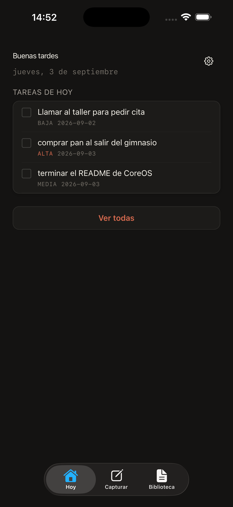
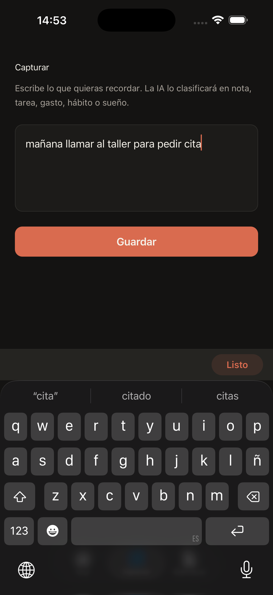
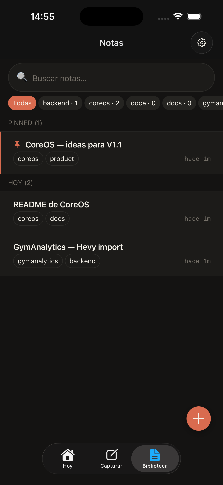
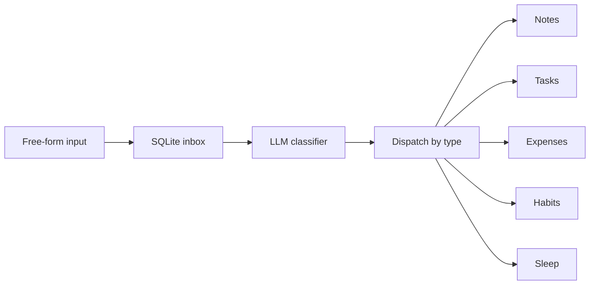

<div align="center">

# CoreOS

### Capture first. Organize later.

A local-first personal second brain for free-form text capture, persisted on
device and organized automatically by an AI classifier.

[](#)
[](#)
[](#)
[](#)

[repository](https://github.com/EzequielMenor/CoreOS) · [ezequielmenor.es](https://ezequielmenor.es)

</div>

---

## What is CoreOS?

Most note and task apps make you decide *where* something belongs before you
can save it: pick a notebook, pick a project, pick a list, pick a tag. That
decision cost is what stops most captures from happening.

CoreOS removes it:

> **Capture → Persist locally → Classify with AI → Organize automatically**

You write free-form text. It is stored on the device before any AI call. An
LLM then classifies it into a structured table. The raw input is never lost,
never rewritten, and organization happens *after* capture, never before.

## Screenshots

| Today | Capture | Library |
| --- | --- | --- |
|  |  |  |
| Today's tasks and pending captures at a glance. | One field. Anything you want to remember. | Notes grouped by recency, with full-text search. |

Drop the three PNGs into `assets/screenshots/` (named `Today.png`, `Capture.png`, `Biblioteca.png`) and uncomment each image.

## How it works



Key properties:

- **Raw input is persisted first** — the SQLite insert happens before the
  network call.
- **`raw_text` is canonical** — for notes it is stored verbatim as `body_md`.
  The LLM only emits metadata (suggested title and tags); it never rewrites,
  summarizes or splits the user's text.
- **AI failure never discards captures** — an invalid or failed model
  response leaves the inbox row in `pending` status, retryable from Today.

## 🔒 Local-first by design

- SQLite database lives on the device
- No backend, no remote service
- No account, no auth
- API keys held in `expo-secure-store` (iOS Keychain / Android EncryptedSharedPreferences)
- Capture persisted before any AI call
- AI failure leaves the capture pending — raw text is never lost

## Current V1

Three tabs (Today, Capture, Library) plus Tasks and Settings as secondary
screens.

**Today** — pending and overdue tasks, sorted overdue-first then by priority.
Inline complete. A chip shows unclassified captures and retries the pipeline
on tap.

**Capture** — a single free-text field. On save the text is inserted into the
local inbox and the async classifier runs. Also reachable from the iOS share
sheet and the `coreos://capture` deeplink.

**Library** — notes grouped into Pinned / Today / Yesterday / This week /
Earlier. Full-text search, tag filters, Markdown editor with autosave, pin,
soft-delete with undo and restore.

**Tasks** — full CRUD with date normalization for free-form `due_date` inputs
(`hoy`, `mañana`, `d/m/y`, ISO → `YYYY-MM-DD`).

<details>
<summary><strong>Architecture details</strong></summary>

### Pipeline invariants

Documented in `src/services/inbox.ts` and enforced in code:

- The inbox row is marked `processed` inside the same transaction as the
  dispatch, guarded by `WHERE status='pending'` (lock optimistic).
- Items are processed **sequentially** (`for/await`, never `Promise.all`).
- Exported pipeline functions **never throw** — they return a result the
  caller can retry.
- A module-level mutex (`_batchInFlight`) prevents concurrent batches; late
  captures automatically trigger one extra drain pass.

### Source layout

```
src/app/         expo-router screens (file-based, typed routes)
src/stores/      Zustand stores
src/db/          SQLite singleton, migrations, dispatcher
src/db/queries/  per-domain query modules
src/services/    LLM client + inbox orchestration
src/components/  shared UI
src/hooks/       theme, note editor
src/lib/         animations + note save gate
src/constants/   theme tokens
```

### Notes schema & search

- Notes have a FTS5 virtual table (`notes_fts`) with `tokenize='porter
  unicode61'`, ranked with `bm25`.
- Triggers keep the FTS index in sync on INSERT / UPDATE / DELETE.
- Soft-delete via `deleted_at`; restore sets it back to `NULL`.

### Classification types

The LLM emits one of five types: `nota`, `gasto`, `tarea`, `habito`, `sueno`.
Schema for each is enforced server-side in `processInboxText`; any deviation
marks the capture as `failed` for retry without losing `raw_text`.

### Native tabs

`expo-router`'s `unstable-native-tabs` render the iOS native tab bar on iOS;
Android and web fall back to a JS implementation. This is why a dev build is
required (and Expo Go is not enough).

</details>

## Tech stack

| Layer | Choice |
|---|---|
| Framework | Expo SDK 57, React Native 0.86 |
| Language | TypeScript, strict |
| Routing | `expo-router` (file-based, typed routes) |
| State | `zustand` |
| Database | `expo-sqlite` (FTS5) |
| Secrets | `expo-secure-store` |
| Animation | `react-native-reanimated` 4 + worklets |
| AI | Any OpenAI-compatible chat completions endpoint |

## Status

`v0.1.0` · Personal V1 · Active development

Not a commercial product. Some tables in the pipeline (`gastos`,
`habitos_log`, `sueno_log`) are already written by the classifier, but their
management UI is intentionally not part of V1 — the data is captured and
stored; the screens come later. There is no automated test suite yet.

## Running locally

```bash
npm install
npx expo run:ios
```

A development build is required: the project uses native config plugins
(FTS5-enabled SQLite, SecureStore, iOS share extension) and native tabs, so
Expo Go is not a supported target.

Open **Settings** inside the app and configure the AI provider (base URL, API
key, model). Keys live in `expo-secure-store`; there is no `.env` and nothing
sensitive is committed. Without a key, captures are still saved to the inbox
and stay `pending` until one is configured and the pipeline is retried.

```bash
npm run lint      # ESLint via expo lint
npx tsc --noEmit  # typecheck
```

`expo-secure-store` is unavailable on web — the AI pipeline does not work in a
browser build.

## Out of scope / not in V1

- Backend
- Cloud sync
- Multi-user / accounts
- Hermes vs JSC engine work
- Graph view and embeddings (`note_embeddings` exists in the schema but is unused)
- Expense / habit / sleep management UI

## Author

Built by **Ezequiel Menor** — [ezequielmenor.es](https://ezequielmenor.es) ·
[github.com/EzequielMenor](https://github.com/EzequielMenor)
